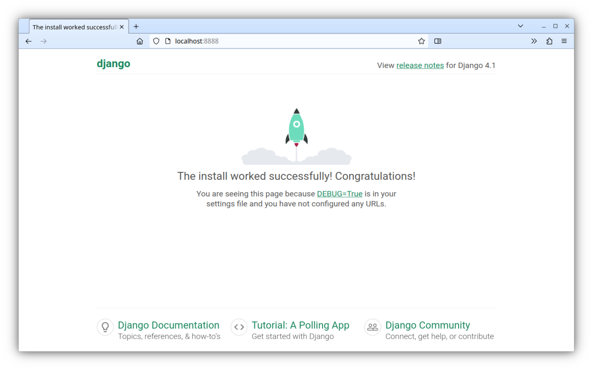

MODULE - DJANGO PROJECT
=======================================================================

> **Purpose**
> explaining concepts :
>   - django project
>   - django app


<br>
***********************************************************************
<div style="page-break-after: always;"><br></div>


I - DJANGO PROJECT
-----------------------------------------------------------------------

> this section describes a basic django project.
> no application will be yet created

###  1.1 - CREATION

```shell
django-admin startproject myproject
```


###  1.2 - STRUCTURE

```text
├── myproject
│   ├── asgi.py
│   ├── __init__.py
│   ├── settings.py
│   ├── urls.py
│   └── wsgi.py
└── manage.py
```


###  1.3 - RUNNING

```shell
#: ./manage.py runserver 127.0.0.1:8888


Watching for file changes with StatReloader
Performing system checks...

System check identified no issues (0 silenced).

You have 18 unapplied migration(s).
Your project may not work properly until you apply the migrations
for app(s): admin, auth, contenttypes, sessions.
Run 'python manage.py migrate' to apply them.
April 16, 2023 - 06:26:19
Django version 4.1.4, using settings 'myproject.settings'
Starting development server at http://127.0.0.1:8888/
Quit the server with CONTROL-C.

```

As no application is yet created, django displays default web page.




<br>
***********************************************************************
<div style="page-break-after: always;"><br></div>


**END**
